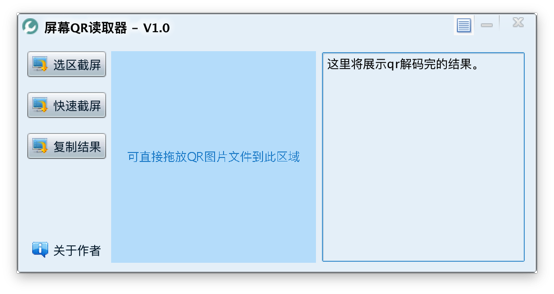

# 屏幕QR读取器

#### 项目介绍
屏幕QR读取器.
  
#### 安装教程

1. 下载release目录下所有文件；
2. 运行对应系统的脚本；
3. 截屏后自动解析屏幕上的qr码。
 
#### 如图

## 源码可以参考的价值:

#### 1.  java最小化到托盘的实现

	关闭时可隐藏到系统托盘功能
		
#### 2.  java截屏api

	快速截屏功能

#### 3.  zxing解析二维码

	截屏图片上的qr读取解析功能

#### 4.  java绘图框选截屏局部

	选区截屏功能

#### 5.  java文件拖拽api

	没有截屏图片时可直接拖拽一个qr图片文件到蓝色区域进行解码
	
#### 6. java保持窗口最前

	菜单项-保持窗口最前功能
	
#### 7.  java隐藏到托盘时的菜单项目设置

	托盘icon右键弹出菜单

#### 8.  重定义java面板右上角的布局

	右上角的菜单按钮,最小化按钮,关闭按钮的实现
	
## 大感谢

1. 感谢zxing解码库
2. 感谢老三的SwingC图形库